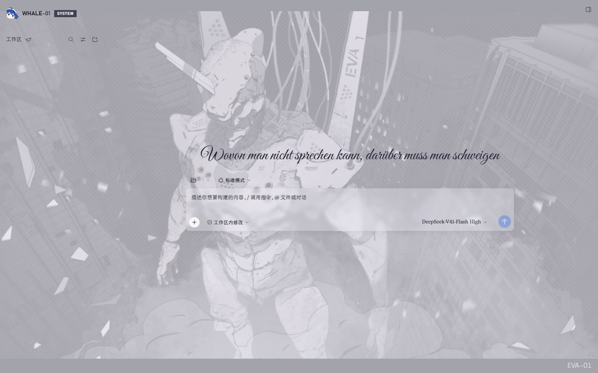
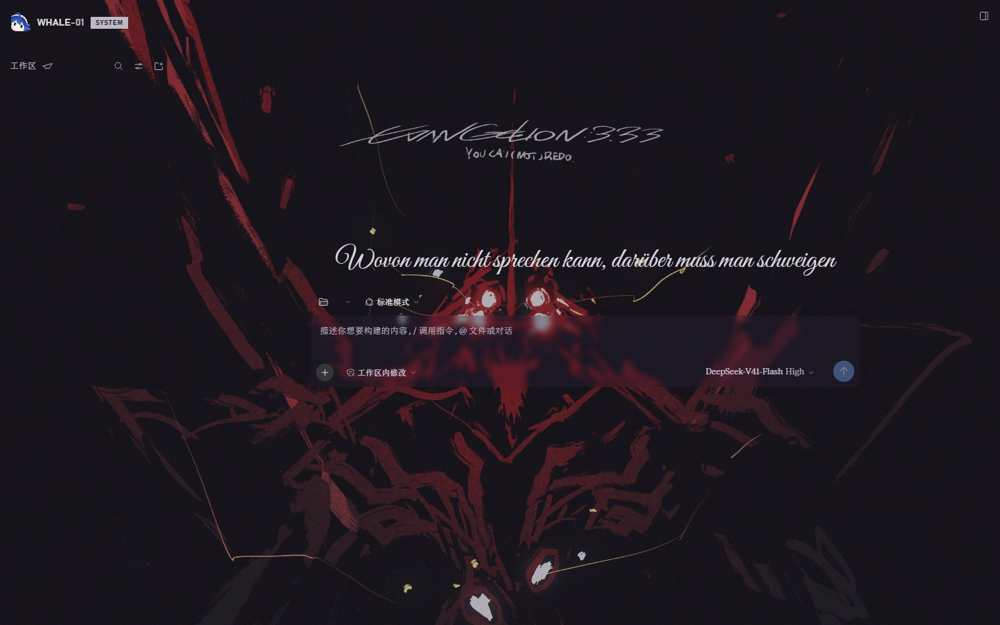

# EVA-Inspired-Theme

[](#licence)
[](#fan-work-and-attribution)

English | [中文](README.zh.md)

A Neon Genesis Evangelion–inspired skin for **DeepSeek Harness**. Two fully
designed modes over one removable override layer, a wallpaper paint layer whose
alphas are solved against a contrast budget rather than picked by eye, a boot
mask, and four tiered task sounds.

This repository ships **no background picture of its own**: the paint layer is
here, the artwork is not. Instead the tracked wallpaper manifest names two
third-party pictures by URL, so a clone draws a background the browser fetches
from wallhaven at paint time. The only pictures in git are the brand marks and
the two preview screenshots, which naturally show the art the app was painting;
the theme's look is otherwise unchanged — the alphas, the boot mask, the brand
mark and the fonts all come from this repository.

**Unofficial fan work.** Not affiliated with, endorsed by, or licensed by
khara, inc., Hypergryph, or DeepSeek. See
[Fan work and attribution](#fan-work-and-attribution).

## Preview

Both modes, captured from a running DeepSeek Harness with this package mounted.
The session list is hidden in both shots; nothing else is retouched.

**Title Card — light**



**Central Dogma — dark**



The backgrounds are the two wallhaven pictures the tracked manifest names, so
these are what a clone shows once the browser has fetched them; the credits are
in [Fan work and attribution](#fan-work-and-attribution).

## What it is

| | |
|---|---|
| Modes | **Title Card** (light) and **Central Dogma** (dark) |
| Token layer | 55 measured overrides (41 in the light arm, 14 in the dark arm) on a single removable layer |
| Wallpaper layer | No artwork ships in this repository; the browser fetches it at paint time. The tracked manifest points at two third-party pictures on wallhaven; the maintainer's own machine embeds local copies instead. Surface alphas are solved against a WCAG contrast budget |
| Boot mask | Shown on load; unchanged timings and triggers |
| Task sounds | `ask`, `done`, `fail`, `plan` — four WAVs, ported from `dsh-perlica-ding` v0.2.0. A plain Q&A turn stays silent. No startup chime. |
| Brand mark | One client-side illustration, two tones |
| Also inside | A plugin on/off switch and a session-row status rail, both vendored from MIT plugins; a pin button on every workspace and session row; a Telegram filter on the workspace row |
| Language | All user-facing text goes through the official locale service (zh / en) |

The theme installs one layer and can be removed as one. It ships **no settings panel
of its own** — the look is fixed, not a preference — and the only thing it persists
is the workspace pin set. It does hide and move a few official entries, so read
[What it changes in the interface](#what-it-changes-in-the-interface) before you
install it.

## What it changes in the interface

Removing the package takes the layer away again and every official element comes
back. In between, the theme **hides five official controls, rewrites the sidebar
identity line, and replaces one page's heading**. All of it is CSS plus a few client
effects — the official DOM is never rewritten — but here is where things went.

### The brand row is three click zones

The sidebar brand row reads **[illustration] WHALE-01 [SYSTEM]**; the official
wordmark and its whale glyph are hidden. It is one official button carrying three
zones, decided from the click's x coordinate at click time:

| Click | Opens | Because |
|---|---|---|
| the illustration, left of `WHALE-01` | **Plugins** | the 「插件」/ “Plugins” nav row is hidden |
| the `WHALE-01` text | a **new session** | official behaviour, unchanged |
| the `SYSTEM` chip, right of `WHALE-01` | **Settings** | the 「设置」 row and its launcher button are hidden |

The zones drive the hidden buttons programmatically, so both still open. A Plugins row
that your composition does not have is not intercepted at all — the click falls
through to the official new-session handler instead of becoming a hole. Keyboard
activation (Enter or Space on the focused button) and any click held with a modifier
key are left alone. Collapse the sidebar to a rail and there is no brand button, so
there are no zones either.

### Hidden official entries

| Entry | Where | Way back |
|---|---|---|
| 「应用」/「编辑」 title-bar menu | desktop shell only; absent in a browser | none from inside the app: 关于 / 检查更新 / dsh 命令 / 退出应用 go with it. Quit is still on the tray menu. |
| the second 「新会话」 button | sidebar, below the brand row | `WHALE-01`, or `Ctrl+Alt+N` — it is a duplicate |
| 「插件」/ “Plugins” nav row | sidebar | click the illustration; **no shortcut is left** |
| 「设置」 row and its launcher button | sidebar | click `SYSTEM`, or `Ctrl+Alt+,` |
| 「收起侧栏」 button | left sidebar only; the right sidebar's stays visible | the collapse command itself is untouched |
| the session list's bottom fade | sidebar | it only dimmed the last row |

Nothing else in the sidebar moves. The workspace and session list keeps the official
`flex: 1` scrolling area, and the bottom area still shows whatever a third-party
plugin registers into `sidebar.footer.action` (a ledger card, say) in the position the
host gives it.

### The new session page (hero)

Three changes, on that page only:

- the headline is replaced by one fixed German line, exactly as registered:
  `Wovon man nicht sprechen kann, darüber muss man schweigen`;
- the 「预览版」/ “Preview” badge is gone;
- the whale logo above the headline is gone.

That line is set in **Great Vibes** (SIL OFL 1.1, shipped in the package) at
`min(44px, 5.3cqw)` and never wraps. Two costs, stated plainly: it is injected as
generated content, so find-in-page and screen readers do not see it, and it does not
follow the interface language — a Chinese and an English user both read the German.

### What the theme adds

- A **pin button** on every workspace and session row (置顶工作区 / Pin workspace,
  following the host's language). The pinned set is kept in browser storage under
  `eva-theme/workspace-pins`; the order it produces is written through the host's own
  insert-before API, so it survives a restart — and, unlike the pin set, it also
  survives removing the theme.
- A **Telegram filter** on the 「工作区」 row, on the same line as Search and the view
  options: one click expands the groups and leaves only the conversations `dsh-im`
  opened for Telegram, and another click puts the official list back. It only tags
  rows and stores nothing, and it has nothing to show until such conversations exist.
- The vendored **non-official plugin switch**, on the installed group's header in the
  official Plugins page: tick which non-official plugins to disable, or to enable
  again. It switches bundle enablement only — it installs and uninstalls nothing.
- The vendored **session status rail**: blue and breathing while a session waits for
  you (an approval, a question, a plan review), red while it is the one open in the
  main area, purple while it finished unread. A pinned row gets a rainbow title
  instead of a rail.
- The **boot mask** once per page load, and the four **task sounds**.

Settings themselves remain the official dialog. The single change there is that the
dim tint behind it is removed; the panel and click-outside-to-close are untouched.

## Requirements

- DeepSeek Harness with a web profile.
- Node.js >= 18 — only for the build and check tools. The theme itself runs in
  the browser.

## Install

From this checkout or a clone of it:

```
npm run build                                              # writes the browser bundle
dsh plugin --profile <profile> add link:<path-to-this-checkout>
```

Run the build once after cloning: `client.js` is generated and deliberately not
tracked (see [Layout](#layout)). A clone builds the tracked form: the paint layer
points at the two pictures named in `build/wallpapers.json` and the browser
fetches them, so the background needs a network and the host learns the viewer's
IP. That is the intended public form.

The package carries a `prepare` script that runs exactly that build, so an
install straight from the Git URL produces the bundle for you before the package
is linked. A plain `git clone` still needs one build: `npm run build`, or any
`npm install` inside the checkout, which triggers `prepare`.

The package declares `dsh.bundle.patch`, so the profile reconciles its bundle
stack against the installed package and mounts the theme. If it does not appear
after a restart, append `EVA-Inspired-Theme` to `dsh.profile.bundles` in the
profile's `package.json` — a package that is merely a dependency is not mounted.

## Remove

```
dsh plugin --profile <profile> remove EVA-Inspired-Theme
```

Drop the entry from `dsh.profile.bundles` too if you added it there.

## Layout

```
index.js              host half — mounts, plays the task sounds, registers no route
client.js             GENERATED browser bundle. Not tracked; build it. Do not edit.
src/client.js         the real client half
src/theme.css         the token layer
cordis.patch.yml      the bundle-patch mount declaration
build/                shipped assets + the two vendored client halves
build/wallpapers.json the TRACKED wallpaper manifest — art URLs, not image bytes
sounds/               the four task WAVs
tools/                build, self-check, token audit, sound layer gate
docs/                 design log, recon, audits, render reports, preview shots
NOTICE                upstream licences and third-party credits
LICENSE               this package's layered licence
LICENSE-CC-BY-NC-SA-4.0.txt  the CC licence text for the brand marks
```

`client.js` is generated from `src/` and carries a banner saying so. Edit `src/`
and run `npm run build`; the check gate fails if the two drift apart.

The wallpaper manifest has two layers, and the tracked one names art instead of
carrying it:

- `build/wallpapers.json` — tracked. Two entries, each with a `direct:` URL that
  points at a third party's copy of the picture, plus the `page:` a credit
  belongs on. The build emits `url("https://…")`, so the theme keeps its
  background while this repository still holds no image bytes. An empty list is
  also legal: it publishes `--cp-pick-light: none; --cp-pick-dark: none;`, the
  paint layer's documented no-art state.
- `out/wallpapers.local.json` — ignored by git. The same shape with `dataUrl:`
  entries; if it exists the build reads it instead and embeds the art, which is
  how the maintainer's own machine keeps looking the way it does. `node
  tools/build-client.mjs --public` ignores it and builds the tracked form anyway.

Because `client.js` is ignored too, and the tracked manifest holds no `dataUrl:`,
a bundle that carries artwork has nowhere to be committed. Those facts are
asserted (`wall.2`, `wall.6`, `wall.7`, `wall.8`).

## Checks

```
npm run verify
```

Runs every gate: syntax check of both bundle halves, the self-check (115
assertions), the token audit (55 overrides, exactly the planned 55), the sound
layer gate (25 checks: format, byte length and peak of each WAV), and a rebuild
comparison that proves `client.js` is in sync with `src/`.

## Licence

This package uses **tiered licensing**. Each licence applies only to the part it
is named against; none of them is an alternative licence for the whole
repository. Images and third-party materials sit outside the blanket grants
unless a row says otherwise, and catalogue data (`build/*.json`) describes assets
without licensing them. No trademark rights are granted here.

| Part | Licence | What it asks of you |
|---|---|---|
| Our code — `index.js`, `src/`, `tools/`, `client.js` | MIT | Keep the copyright and licence notice. Commercial use of the code is fine. |
| Project text — this README, `docs/`, `NOTICE`, `LICENSE` | CC BY-NC-SA 4.0 | Credit, link the licence, note changes, keep it non-commercial, share alike. |
| Brand marks — `build/brand-mark*.png`, `build/brand-mark.jpg` | CC BY-NC-SA 4.0 | Same terms, and this is third-party artwork: see below. |
| Task sounds — `sounds/*.wav` | MIT (upstream `dsh-perlica-ding`) | Keep upstream's notice. |
| Font — `build/great-vibes-latin.woff2` | SIL OFL 1.1 | Keep the notice; do not sell the font on its own. |
| Vendored halves — `build/plugin-toggle.js`, `build/session-eva-status.js` | MIT (two other plugins, same author) | Keep both notices; they are inlined into `client.js` too. |
| The two background wallpapers | **Hotlinked, not distributed, not licensed here.** | This project grants you no rights in them; the credits below are attribution only. |

Because the brand marks forbid commercial use, **the package as a whole may not
be used commercially**. The MIT code on its own is not restricted; drop the brand
marks if you need a commercial-use build.

Full terms: [LICENSE](LICENSE). Upstream texts and per-file credits:
[NOTICE](NOTICE). The CC BY-NC-SA 4.0 legal text ships as
[LICENSE-CC-BY-NC-SA-4.0.txt](LICENSE-CC-BY-NC-SA-4.0.txt) and is also at
<https://creativecommons.org/licenses/by-nc-sa/4.0/>.

## Fan work and attribution

**Unofficial fan work.** Not affiliated with, endorsed by, or licensed by khara,
inc., Hypergryph, or DeepSeek. The theme is a non-commercial fan work, made under
khara's published fan-work guideline (<https://www.khara.co.jp/guideline/>),
which permits non-commercial fan works and licenses neither the characters nor
the brand. Working outside the limits of that guideline needs a separate licence
from khara. The `EVA` in the package name is a reference, not a claim of origin.

**Brand mark.** Character 溟月 by 上善无形 (original character,
<https://space.bilibili.com/4456176>). DeepSeek-elements second pass by ZipZipPipe
(GPT Image 2, <https://space.bilibili.com/4168597>). Refined repair by QYQCAMIAO.
Licensed CC BY-NC-SA 4.0 — credit, non-commercial, share alike. This repository
cropped and resized the illustration to 256×256 and derived the dark variant with
`tools/make-brand-mark-dark.py`; both derived images stay under the same terms.
Commercial use of this artwork needs permission from the rights holders above.

**Task sounds.** From `dsh-perlica-ding` v0.2.0 by 117BS (MIT), rescaled to 60%
volume. The voice lines are upstream's, for the character Perlica (佩丽卡) from
Arknights: Endfield (© Hypergryph / GRYPHLINE).

**Font.** "Great Vibes" by TypeSETit, SIL OFL 1.1.

**Wallpapers — hotlinked with credit, never redistributed.** Two background
images are part of the theme's intended look. Since 2026-10-09 (D79) neither is
in this repository, and since D81 the tracked manifest points at
them instead of embedding them: a build shows the pictures while this repository
carries none of their bytes and grants you no rights in them. The browser fetches
them from wallhaven when the theme paints, so nothing is mirrored here and an
offline machine simply has no background. The one place they do appear in git is
the two preview screenshots above, which are captures of the app painting them.
Provenance, recorded because it is what a takedown request would be about:

- Dark — **Central Dogma**, `og33jl`,
  [wallhaven.cc/w/og33jl](https://wallhaven.cc/w/og33jl), 2560×1440. Wallhaven
  credits the artist **YOTA SAKI**, and the entry links to the original posting,
  [pixiv artwork 133258822](https://www.pixiv.net/en/artworks/133258822).
  Uploaded to wallhaven by *Elisban*.
- Light — **Title Card**, `x85po3`,
  [wallhaven.cc/w/x85po3](https://wallhaven.cc/w/x85po3), 1760×1066. Wallhaven
  records no source for this upload (uploader *BachoWilson*), so the artist is
  unknown; the same artwork also circulates on Chinese wallpaper sites.

We hold no permission from either artist. If you are one of them and object to
being linked this way, say so and the entry will be dropped from
`build/wallpapers.json` and the preview shots with it — nothing here is a copy of
the picture itself.

本仓库图片来自网络流传，具体作者未确认；如原作者认为不妥，请联系删除。
